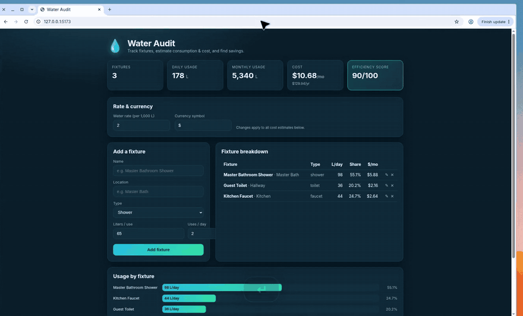

<div align="center">

# Water Audit

**See where the water (and the bill) actually go**

A household / facility dashboard that turns fixtures into daily liters, monthly cost, and concrete savings — not a spreadsheet guess.

[](#getting-started)
[](#repository-map)
[](#getting-started)
[](#watch-the-demo)

</div>

---

## Watch the demo

This walkthrough **plays on this page** — it does not download a file.

<p align="center">
  
</p>

| Time in clip | What you are seeing | Why it matters |
| --- | --- | --- |
| Header KPIs | Fixtures, daily L, monthly L, cost, efficiency score | One glance at whether the house is efficient |
| Fixture table | Shower, toilet, faucet with share of usage | You can see *which* fixture is driving the bill |
| Edit Guest Toilet | Form fills, then Cancel | Edits are real API writes; cancel is safe |
| Recommendations | Low-flow shower savings in L/month and $/month | Advice is tied to the same rate as the bill |

---

## In plain English

Most “water audits” dump a PDF of generic tips. This app does the arithmetic that actually changes behavior:

1. You register each fixture (shower, toilet, faucet, dishwasher, washer, irrigation).
2. The server multiplies **liters per use × uses per day × your water rate**.
3. It compares each fixture to an efficient benchmark and tells you how much you would save.

The UI and the API share one model. Change a shower from 65 L to 40 L and the monthly cost, bar chart, and recommendation all move together.

---

## How the numbers are built

```text
Fixture  →  liters/use × uses/day  →  daily L
                                      │
                                      ├─► monthly L  (× 30)
                                      └─► cost       (× costPerLiter)

Recommendation  =  (actual L/use − efficient L/use) × uses/day × 30
```

`costPerLiter` lives in settings (shown in the UI as a rate per 1,000 L). Currency is configurable. Seed data on first run is an efficient household so the demo starts at score **90/100**.

---

## Repository map

```text
water-audit-/
├── client/                 React + Vite + TypeScript UI  (:5173)
│   └── src/App.tsx         Dashboard, fixtures, recommendations
├── server/                 Express + TypeScript API       (:3001)
│   └── src/
│       ├── index.ts        REST routes
│       ├── store.ts        JSON persistence
│       ├── audit.ts        Totals + savings
│       └── validation.ts   Fixture / settings parsing
├── data/                   fixtures.json + settings (created at runtime)
├── docs/
│   ├── demo.mp4
│   └── demo-poster.jpg
├── package.json            npm workspaces root
└── README.md
```

---

## Getting started

Node.js **20+** (developed on 22).

```bash
npm install        # both workspaces
npm run dev        # API :3001  +  web :5173
```

Open [http://localhost:5173](http://localhost:5173). Vite proxies `/api/*` to the server.

| Command | What it does |
| --- | --- |
| `npm run dev:server` | API only (`tsx` watch) |
| `npm run dev:client` | Web client only |
| `npm run build` | Type-check + build both |
| `npm run typecheck` | Type-check both workspaces |

---

## API

| Method | Path | Description |
| --- | --- | --- |
| `GET` | `/api/health` | Health check |
| `GET` | `/api/fixtures` | List fixtures |
| `POST` | `/api/fixtures` | Create a fixture |
| `PUT` | `/api/fixtures/:id` | Update a fixture |
| `DELETE` | `/api/fixtures/:id` | Delete a fixture |
| `GET` | `/api/settings` | Water rate + currency |
| `PUT` | `/api/settings` | Update rate and/or symbol |
| `GET` | `/api/summary` | Usage, cost, recommendations |

Fixture body:

```json
{
  "name": "Master Bathroom Shower",
  "location": "Master Bath",
  "fixtureType": "shower",
  "litersPerUse": 75,
  "usesPerDay": 2
}
```

`fixtureType` is one of `shower`, `toilet`, `faucet`, `dishwasher`, `washingMachine`, `irrigation`, `other`.

---

<p align="center"><sub>Water Audit · measure, then save</sub></p>
